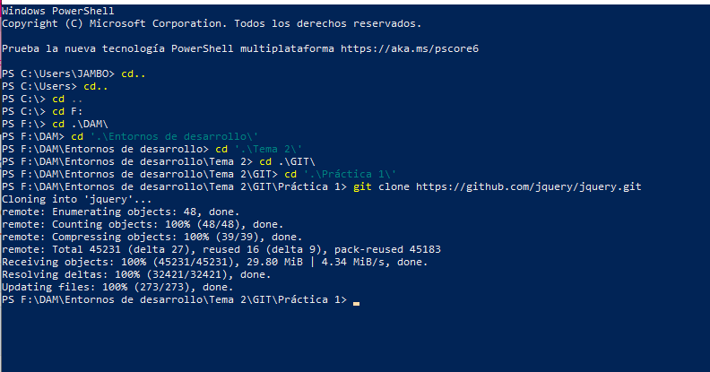
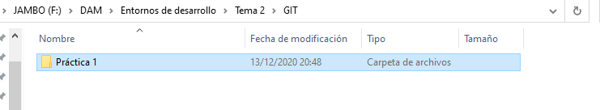
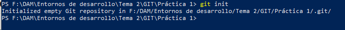

# Práctica GIT.Inicial
## Clonar repositorio externo.

#### 1. Crear un directorio donde vamos a empezar el proyecto y acceder a él.

#### 2. Inicializar el repositorio.

#### 3. Cread un primer archivo "archivo1.txt".

#### 4. Visuaalizad el estado del proyecto

#### 5. Pasad el archivo del espacio de trabajo a la zona de preparación.

#### 6. Visualizad de nuevo el estado del proyecto.

#### 7. Realizad el primer commit y visualizad de nuevo el estado del proyecto.

#### 8. Cread dos archivos más al proyecto. "archivo2.txt" y "archivo3.txt".

#### 9. Pasad el segundo archivo a la zona de preparación.

#### 10. Segundo commit del proyecto.

#### 11. Añadid el ultimo archivo a la zona de preparación y realizad el commit.

Sin querer le he vuelto a llamar segundo commit.

#### 12. Mostrad el log de todos los cambios.

#### 13. Cambiad el archivo "archivo1.txt" y verificad el estado de git.

#### 14. Pasad el archivo a la zona de preparación.

#### 15. Modificad los archivos 2 y 3 del proyecto. Verificad estado del git.

#### 16. Pasad los archivos 2 y 3 a la zona de preparación.

#### 17. Realizar el commit de los cambios realizados.

#### 18. Mostrad el log de todos los cambios.

#### 19. Asociar el Repositorio con un propio creado en github.

#### 20. Subir los cambios al repositorio remoto.

